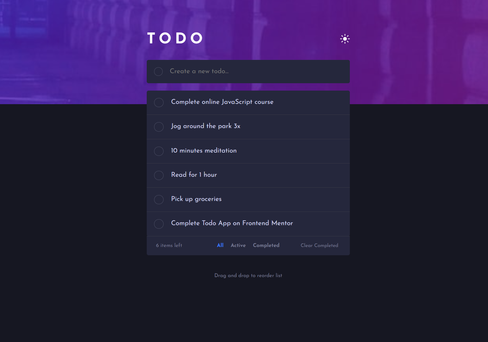

# Frontend Mentor - Todo app solution

This is a solution to the [Todo app challenge on Frontend Mentor](https://www.frontendmentor.io/challenges/todo-app-Su1_KokOW).

## Table of contents

- [Overview](#overview)
  - [The challenge](#the-challenge)
  - [Screenshot](#screenshot)
- [My process](#my-process)
  - [Built with](#built-with)
  - [What I learned](#what-i-learned)
  - [Continued development](#continued-development)

## Overview

### The challenge

Users should be able to:

- View the optimal layout for the app depending on their device's screen size
- See hover states for all interactive elements on the page
- Add new todos to the list
- Mark todos as complete
- Delete todos from the list
- Filter by all/active/complete todos
- Clear all completed todos
- Toggle light and dark mode
- Drag and drop to reorder items on the list

### Screenshot

## My process

### Built with

- Semantic HTML5 markup
- CSS custom properties
- Flexbox
- CSS Grid
- JavaScript

### What I learned

- JavaScript Fundamentals: I deepened my understanding of JavaScript's core concepts, such as variables, functions, loops, and conditional statements. I learned how to apply these concepts to solve practical problems.
- DOM Manipulation: I discovered how the Document Object Model (DOM) works and how to manipulate HTML elements using JavaScript. This included creating, modifying, and removing elements, which is essential for building interactive applications.
- Event Handling: During the project, I learned how to use event handlers to manage user interactions, such as button clicks or form submissions. This was crucial for enhancing the user experience.
- Data Storage: By utilizing local storage (localStorage) to save tasks, I learned how to persist data in the user's browser, allowing the application to maintain its state even after a page refresh.
- User Interface Design: I gained insights into the basics of user interface design, learning how to create a user-friendly and visually appealing application. This involved using CSS to add styles.
- Error Handling: I learned how to handle errors and ensure that the application behaves as expected in various situations, such as adding empty tasks or dealing with invalid inputs.

### Continued development

- Advanced JavaScript Concepts: I want to deepen my understanding of advanced JavaScript concepts, such as asynchronous programming, promises, and async/await. This will help me build more complex applications.
- CSS Frameworks: While I have a good grasp of CSS, I want to explore CSS frameworks like Bootstrap or Tailwind CSS to streamline my styling process and learn best practices for responsive design.
- Testing: I want to focus on writing tests for my applications. Learning testing frameworks like Jest or Mocha will help me ensure my code is reliable and maintainable.
- Accessibility (a11y): I want to continue improving my knowledge of web accessibility standards to ensure that my applications are usable for all users, including those with disabilities.
- Performance Optimization: I want to learn more about performance optimization techniques, such as code splitting, lazy loading, and minimizing render-blocking resources to enhance user experience.
- Responsive Design Techniques: While I have learned the basics of responsive design, I want to refine my skills in using media queries and flexible layouts to create seamless experiences across various devices.
- Version Control Best Practices: I want to improve my understanding of version control best practices, including branching strategies and commit message conventions, to enhance collaboration in team projects.
- Deployment and DevOps: I want to learn more about deploying applications and understanding DevOps practices, including CI/CD pipelines, to streamline the development process.
